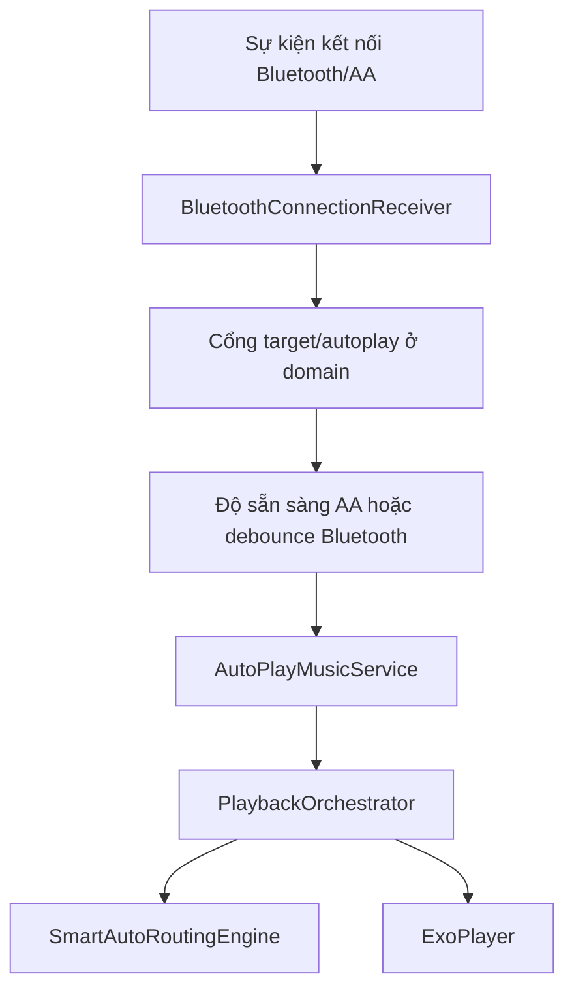

# Kế hoạch kỹ thuật BlueCruise

Tài liệu này là kế hoạch kỹ thuật hiện tại được rút ra từ mã nguồn, cấu hình và kiểm thử trong repository. Đây không phải lộ trình marketing; mục tiêu là giúp người phát triển biết hệ thống đang có gì, vùng nào cần giữ ổn định, cần kiểm thử gì khi thay đổi và thứ tự ưu tiên hardening hợp lý.

## 1. Ý định sản phẩm

BlueCruise là ứng dụng Android hỗ trợ phát âm thanh tự động hoặc thủ công khi người dùng kết nối với xe/head unit. Giá trị chính nằm ở độ tin cậy trong môi trường khó: sự kiện Bluetooth không ổn định, Android Auto có thời gian handoff, OEM có thể tắt tiến trình nền, file âm thanh có thể đến từ server hoặc bộ chọn file local, và playback phải đi qua foreground service.

Phạm vi hiện tại:

- Đăng nhập bằng phone/password qua API thiết bị.
- Lưu session và tự vào màn chính nếu đã login.
- Đồng bộ hai âm thanh `hello` và `goodbye` từ server.
- Cho phép user chọn file audio local cho từng slot.
- Chọn xe mục tiêu bằng MAC của thiết bị Bluetooth đã ghép đôi.
- Tự phát khi target kết nối.
- Có nhánh Android Auto và đường dự phòng cho aftermarket.
- Play/stop thủ công từ màn chính.
- Bong bóng nổi hai nút.
- Foreground service keep-alive.
- Helper cho battery/auto-start settings theo OEM.

Ngoài phạm vi hiện tại:

- Stream trực tiếp audio từ cloud/Drive.
- Tự cấp quyền OEM/battery/overlay thay user.
- Bảo đảm Google Play approval khi chưa harden release posture.
- Hỗ trợ nhiều xe active cùng lúc.
- UI quản trị server account ngoài login/logout/sync.

## 2. Baseline kiến trúc hiện tại

Các module:

- `:domain`: contract, use case và domain model.
- `:data`: DataStore, Bluetooth adapter repo, auth/customer API client.
- `:app`: UI, Hilt wiring, Android receiver/service, playback và overlay.

Chủ sở hữu runtime:

- Launch/auth: `LaunchGateActivity`, `LoginActivity`, auth view model/repository.
- UI chính: `BluetoothFragment`, `BluetoothViewModel`, RecyclerView adapter.
- Autoplay do kết nối kích hoạt: `BluetoothConnectionReceiver`.
- Độ sẵn sàng Android Auto: `AndroidAutoReadinessProbe`, `AndroidAutoHandoffSessionStore`.
- Playback: `AutoPlayMusicService`, `PlaybackOrchestrator`.
- Điều khiển overlay: `FloatingBubbleService`.
- Sống sót trong nền: `KeepAliveService`.

Invariant kiến trúc:



Không chuyển quyền start playback do sự kiện kết nối sang `AndroidAutoDetectionReceiver`. Receiver đó hiện chỉ restore keep-alive và log rằng playback start vẫn thuộc `BluetoothConnectionReceiver`.

## 3. Quy tắc phát triển

### Giữ nguyên các gate hành vi

Trước khi sửa autoplay:

- Chứng minh symptom là do connection-triggered path hay playback/session path.
- Kiểm tra gate target MAC.
- Kiểm tra `autoPlayEnabled`.
- Kiểm tra `autoPlayOnAndroidAuto`.
- Kiểm tra session state của Android Auto.
- Kiểm tra guard chống duplicate/stale playback.

### Tách manual play khỏi autoplay

Play thủ công là ý định trực tiếp của user. Không chặn play thủ công bằng cổng dành cho connection-time autoplay trừ khi có quyết định UX/product rõ ràng.

### Không làm yếu cleanup

Đăng xuất phải:

- Dừng playback control đang hiển thị.
- Xóa session.
- Xóa setting scoped theo user.
- Xóa cached customer songs.
- Điều hướng về login.

### Không âm thầm bật bề mặt rủi ro

Các thay đổi chạm vào những vùng sau cần review release/security:

- Overlay permission.
- Battery optimization exemption.
- Special-use foreground service.
- Boot receiver.
- Cleartext HTTP.
- Lưu token/session.
- Log MAC address.

## 4. Nhóm việc ưu tiên

### P0 - Tài liệu và release clarity

Trạng thái: đang thực hiện.

Mục tiêu:

- Giữ README và docs khớp với source.
- Làm rõ rủi ro release.
- Làm các lệnh test dễ tìm.

Tiêu chí chấp nhận:

- README link tới các tài liệu chuyên sâu.
- Tài liệu kiến trúc, main flow và device optimization đều dựa trên source.
- Cổng phát hành liệt kê blocker và bằng chứng cần có.

### P1 - Hardening release

Rủi ro thấy từ code/config:

- API base URL dùng HTTP.
- `network_security_config.xml` cho phép cleartext tới `103.118.28.117`.
- Manifest dùng `FOREGROUND_SERVICE_SPECIAL_USE`.
- Ứng dụng dùng overlay và quyền battery exemption.

Hành động khuyến nghị:

1. Chốt kênh phân phối: APK nội bộ, enterprise/direct install hay Google Play.
2. Nếu đi Google Play, viết product justification cho foreground service và overlay.
3. Đưa API base URL vào build config/flavor nếu có nhiều môi trường.
4. Ưu tiên HTTPS nếu server hỗ trợ.
5. Rà soát cách lưu token trong DataStore và cách ghi log.
6. Tạo device matrix riêng cho release.

### P1 - Xác thực Android Auto ngoài hiện trường

Các test nguồn đã bao phủ logic readiness, nhưng timing cần được chứng minh trên phần cứng thật.

Kịch bản thiết bị khuyến nghị:

- Mục tiêu Bluetooth-only kết nối và chỉ start sau khi route đã sẵn sàng.
- Head unit Android Auto chính thức đạt state ready trước playback.
- Mục tiêu aftermarket/OXPRO đi đường dự phòng mà không chờ vô hạn.
- Disconnect trong lúc AA wait không để lại stale session.
- Reconnect hủy pending stop verification đúng.

### P1 - Xác thực permission/OEM UX

Cần bằng chứng thiết bị thật:

- Android 12+ đường cấp quyền Bluetooth.
- Android 13+ audio và notification permission path.
- Android 14 foreground service behavior.
- Xiaomi auto-start settings path.
- Samsung battery settings path.
- Overlay permission return-to-app behavior.

### P2 - Độ bền API và auth

Hành vi hiện tại:

- Đăng nhập validate input rỗng cục bộ.
- Lỗi mạng IO map thành network error.
- Thiếu access token/user ID map thành server error.
- Customer-song sync có thể partial complete.

Cải tiến tiềm năng:

- Thêm timeout/retry policy cho OkHttp nếu product cần offline resilience.
- Hiển thị chi tiết hơn khi server sync partial.
- Thêm environment config cho API base URL.
- Gia cố lưu token nếu threat model yêu cầu.

### P2 - Đánh bóng playback

Bảo vệ hiện có:

- Guard duplicate start.
- Guard command version.
- Chặn passive system resume.
- Audio focus recovery.
- State runtime cho bubble/UI.

Cải tiến tiềm năng:

- Hiển thị lỗi rõ hơn khi selected audio URI không còn mở được.
- QA thiết bị cho audio focus khi có cuộc gọi/navigation prompt.
- Cấu trúc log/telemetry cho manual play nếu support cần chẩn đoán field issue.

## 5. Chiến lược test

### Xác thực local diện rộng

```powershell
.\gradlew.bat --no-daemon :domain:test --console=plain
.\gradlew.bat --no-daemon :data:testDebugUnitTest --console=plain
.\gradlew.bat --no-daemon :app:testDebugUnitTest --console=plain
.\gradlew.bat --no-daemon :app:assembleDebug --console=plain
```

### Kiểm tra tập trung theo vùng thay đổi

Auth/login:

```powershell
.\gradlew.bat --no-daemon :app:testDebugUnitTest --tests "com.vibegravity.bluecruise.auth.*" --console=plain
.\gradlew.bat --no-daemon :data:testDebugUnitTest --tests "com.vibegravity.bluecruise.data.auth.*" --console=plain
```

Customer song sync:

```powershell
.\gradlew.bat --no-daemon :data:testDebugUnitTest --tests "com.vibegravity.bluecruise.data.customer.*" --console=plain
```

Receiver Bluetooth/AA:

```powershell
.\gradlew.bat --no-daemon :app:testDebugUnitTest --tests "com.vibegravity.bluecruise.receiver.*" --console=plain
```

Playback:

```powershell
.\gradlew.bat --no-daemon :app:testDebugUnitTest --tests "com.vibegravity.bluecruise.service.*" --console=plain
```

UI state:

```powershell
.\gradlew.bat --no-daemon :app:testDebugUnitTest --tests "com.vibegravity.bluecruise.ui.*" --console=plain
```

Kiểm thử khói instrumentation:

```powershell
.\gradlew.bat --no-daemon :app:connectedDebugAndroidTest --console=plain
```

## 6. Bản đồ regression

| Vùng | Triệu chứng hồi quy | Tệp/test nên kiểm tra đầu tiên |
| --- | --- | --- |
| Đăng nhập | Ứng dụng kẹt ở login hoặc vào main với session sai | `LaunchGateViewModel`, `LoginViewModel`, auth tests |
| Đồng bộ server | File thủ công bị overwrite sau login ngoài ý muốn | `DefaultCustomerSongSyncRepositoryTest` |
| Cổng target | Xe sai vẫn start playback | `VerifyTargetBluetoothDeviceUseCaseTest`, receiver tests |
| Bluetooth route | Phát quá sớm qua loa điện thoại | `BluetoothConnectionReceiverAndroidAutoTest` |
| Android Auto | Chờ mãi hoặc start trước khi AA ready | test readiness/session/retry policy |
| Playback | Duplicate start hoặc stale state | `AutoPlayMusicServiceTest`, test runtime state |
| Passive resume | System UI resume khi autoplay off | `AutoPlayMusicServiceTest`, session store tests |
| Bubble | Button hiển thị sai state hoặc start sai slot | `FloatingBubbleServiceTest` |
| OEM/battery | Banner sai hoặc service không restore | `BluetoothFragmentTest`, `KeepAliveServiceRestorerTest` |
| Audio picker | Drive/cloud URI bị accept | `PlaybackOrchestratorTest`, utility behavior |

## 7. Tiêu chí chấp nhận dựa trên source

Mọi feature/fix sau này cần thỏa:

- Giữ target MAC gating.
- Giữ user-selected manual audio trừ khi user chủ động manual sync server.
- Không start autoplay từ Android Auto detection receiver.
- Xử lý null/missing Bluetooth MAC thành no-op.
- Giữ Android Auto candidate và ready state tách biệt.
- Giữ bảo vệ duplicate/stale playback.
- Không persist floating bubble enabled nếu thiếu overlay permission.
- Giữ logout cleanup đầy đủ.
- Cập nhật docs khi đổi runtime behavior, permission, API hoặc release posture.

## 8. Khoảng trống đã biết

Các điểm này không nhất thiết là bug, nhưng cần evidence trước khi claim release:

- Chưa có device-matrix evidence lưu trong repo cho head unit thật.
- Play Store readiness chưa được chứng minh vì có special-use FGS, overlay, battery exemption và cleartext HTTP.
- API availability không được docs chứng minh; server URL đang hardcode trong DI.
- Đường quyền notification runtime trên Android 13+ cần verify thủ công.
- OEM auto-start intent behavior có thể thay đổi theo OS/vendor version.

## 9. Bảo trì tài liệu

Khi source thay đổi, cập nhật docs theo thứ tự:

1. `docs/TECHNICAL_ARCHITECTURE.md` cho thay đổi module/runtime boundary.
2. `docs/MAIN_FLOW.md` cho thay đổi user flow hoặc receiver/service flow.
3. `docs/DEVICE_OPTIMIZATION.md` cho thay đổi permission/OEM/service.
4. `RELEASE_GATE.md` cho thay đổi release/security/policy posture.
5. `README.md` cho summary cấp cao và link.

Không copy tài liệu cũ sang nếu chưa kiểm tra lại source.
