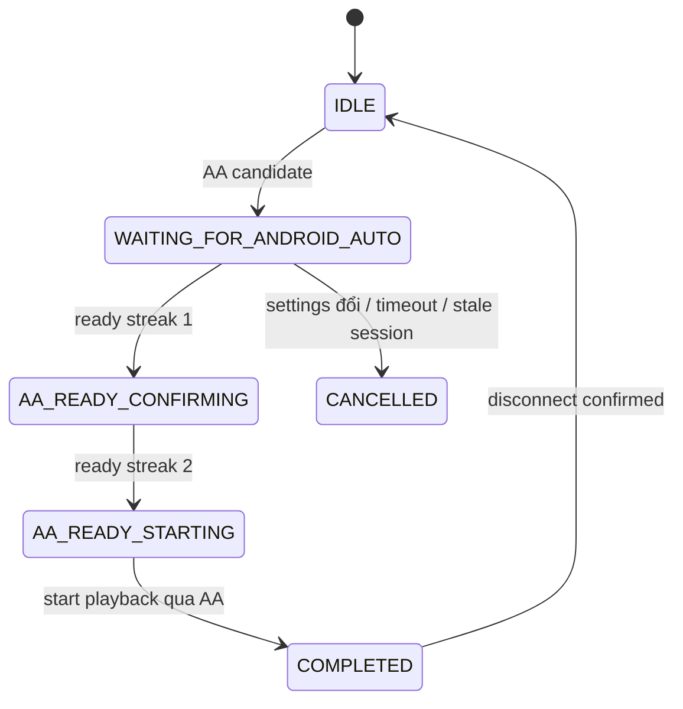
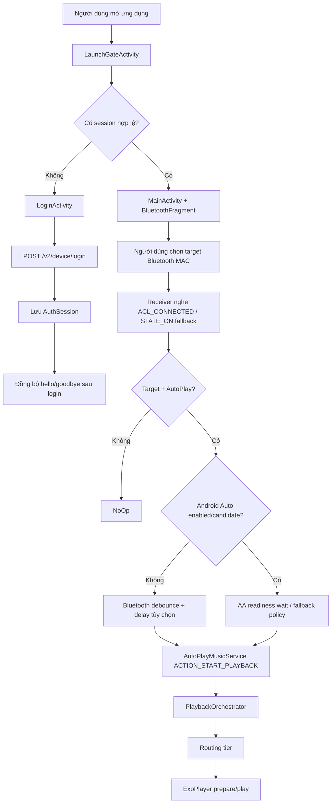

# BlueCruise

BlueCruise là ứng dụng Android native dùng để tự động phát âm thanh khi điện thoại kết nối với xe qua Bluetooth hoặc khi Android Auto đã sẵn sàng. Ứng dụng tập trung vào tình huống thực tế trên xe: người dùng chọn một thiết bị Bluetooth mục tiêu, cấu hình âm thanh chào/tạm biệt, bật hoặc tắt tự phát, và để ứng dụng xử lý khác biệt giữa Bluetooth thường, Android Auto, head unit aftermarket, chính sách pin/OEM và dịch vụ phát nhạc chạy tiền cảnh.

Tài liệu này được viết lại từ mã nguồn, manifest, cấu hình build và test hiện có trong repository. Không dùng nội dung tài liệu cũ làm nguồn.

## Bộ tài liệu

| Tệp | Mục đích |
| --- | --- |
| [`README.md`](README.md) | Tổng quan sản phẩm, kiến trúc, luồng runtime, biên dịch/kiểm thử và ghi chú phát hành ở mức nhập môn. |
| [`PLAN.md`](PLAN.md) | Kế hoạch kỹ thuật hiện tại, phạm vi sản phẩm, nguyên tắc thay đổi và vùng ưu tiên regression. |
| [`RELEASE_GATE.md`](RELEASE_GATE.md) | Checklist release, tiêu chí chặn phát hành, bằng chứng QA và rủi ro Google Play. |
| [`docs/TECHNICAL_ARCHITECTURE.md`](docs/TECHNICAL_ARCHITECTURE.md) | Kiến trúc module, ranh giới hệ thống, DI, lưu bền dữ liệu, playback, Bluetooth/Android Auto và mô hình service. |
| [`docs/MAIN_FLOW.md`](docs/MAIN_FLOW.md) | Các luồng chính: mở ứng dụng/login, đồng bộ server, chọn target, autoplay, Android Auto, play thủ công, bong bóng, logout. |
| [`docs/DEVICE_OPTIMIZATION.md`](docs/DEVICE_OPTIMIZATION.md) | Quyền Android, hành vi OEM battery/auto-start, overlay, keep-alive và matrix kiểm thử thiết bị. |

## Mục tiêu sản phẩm

BlueCruise giải quyết bài toán tự phát âm thanh đúng thời điểm khi xe hoặc màn Android Auto kết nối:

- Nhận diện thiết bị Bluetooth mục tiêu bằng MAC address đã chọn trong ứng dụng.
- Tự phát âm thanh khi thiết bị mục tiêu kết nối, nếu `Auto-Play` đang bật.
- Có nhánh riêng cho Android Auto để tránh phát quá sớm khi hệ thống xe chưa sẵn sàng nhận route âm thanh.
- Cho phép chọn hai slot âm thanh: `Greeting` và `Goodbye`.
- Có thể đồng bộ hai âm thanh này từ server theo tài khoản đăng nhập, hoặc người dùng chọn file local trên máy.
- Dùng Media3/ExoPlayer để phát âm thanh qua foreground service có notification media.
- Có overlay bong bóng nổi để phát nhanh hai slot âm thanh mà không cần mở lại màn chính.
- Có keep-alive foreground service để tăng khả năng sống sót trong nền trên các thiết bị quản lý pin khắt khe.

## Tổng quan kỹ thuật

BlueCruise là project Android Gradle nhiều module:

| Module | Vai trò |
| --- | --- |
| `:app` | UI, Activity/Fragment, receiver, service, Media3 playback, Hilt wiring và hành vi runtime phụ thuộc Android. |
| `:domain` | Use case, interface repository, domain model, action Bluetooth và abstraction routing. Không phụ thuộc Android UI. |
| `:data` | DataStore preferences, Bluetooth adapter repository, auth API, download/cache customer-song và implementation repository. |

Thông tin build chính:

- Application ID: `com.vibegravity.bluecruise`
- Namespace app: `com.vibegravity.bluecruise`
- Compile SDK: `34`
- Target SDK: `34`
- Min SDK: `26` Android 8.0+
- Gradle wrapper: `8.7`
- Android Gradle Plugin: `8.3.0`
- Kotlin: `1.9.23`
- DI: Hilt `2.51.1`
- Playback: Media3 `1.3.1` + ExoPlayer
- Lưu trữ: AndroidX DataStore Preferences
- Mạng: OkHttp `4.12.0` + kotlinx-serialization JSON
- Kiểm thử: JUnit4, MockK, coroutines-test, Turbine, Robolectric, Espresso

## Chức năng chính

### 1. Launch gate và đăng nhập

Luồng mở app bắt đầu tại `LaunchGateActivity`.

- `LaunchGateViewModel` đọc `AuthSessionRepository.sessionFlow`.
- Nếu session có `accessToken` và `userId`, app đi thẳng vào `MainActivity`.
- Nếu chưa đăng nhập hoặc đọc session lỗi, app chuyển sang `LoginActivity`.
- `LoginViewModel` validate số điện thoại và mật khẩu trước khi gọi repository.
- `DefaultAuthRepository` gọi API đăng nhập, lưu session vào DataStore và lên lịch đồng bộ âm thanh sau login.

API đăng nhập hiện được cấu hình trong `AuthModule`:

```text
POST http://103.118.28.117/api/v2/device/login
Nội dung request:
{
  "phoneNumber": "...",
  "password": "..."
}
```

Phản hồi mà code kỳ vọng có các trường:

- `success`
- `accessToken`
- `userId`
- `message`

Khi logout:

- Xóa session đăng nhập.
- Xóa dữ liệu scoped theo user trong preferences.
- Xóa cache file customer songs trong `filesDir/customer-songs`.
- Dừng playback/bubble/keep-alive theo luồng UI hiện tại.

### 2. Màn cấu hình Bluetooth

`MainActivity` là shell đơn giản. Phần lớn UI nằm trong `BluetoothFragment`, `BluetoothViewModel`, `BluetoothScreenAdapter` và `BluetoothDeviceAdapter`.

Màn chính quản lý:

- Danh sách thiết bị Bluetooth đã ghép đôi.
- Thiết bị xe mục tiêu.
- Bật/tắt tự phát khi kết nối.
- Bật/tắt tự phát khi Android Auto kết nối.
- Đánh dấu target là aftermarket/OXPRO để dùng nhánh fallback riêng.
- Độ trễ phát 0-10 giây khi đi theo nhánh Bluetooth.
- Giữ ứng dụng sống nền.
- Overlay bong bóng nổi.
- Chọn file âm thanh cho slot 1 và slot 2.
- Đồng bộ âm thanh từ server.
- Chọn routing tier 1/2/3.
- Play/Stop thủ công.
- Đăng xuất.

UI dùng `RecyclerView` với `ConcatAdapter`:

- Chrome rows: battery banner, auto-start banner, target-car card, empty state, section title.
- Danh sách thiết bị: từng thiết bị Bluetooth đã ghép đôi.
- Footer: logout.

`BluetoothScreenRenderPlan` tách phần tính toán thay đổi UI khỏi adapter để test được các cập nhật partial payload và tránh refresh UI quá rộng.

### 3. Chọn thiết bị mục tiêu

Thiết bị mục tiêu được lưu bằng MAC address trong `SettingsRepository.targetMacFlow`.

Luồng kiểm tra target:

- `GetPairedDevicesUseCase` lấy danh sách thiết bị đã ghép đôi qua `IBluetoothAdapterRepo`.
- `BluetoothAdapterRepo` đọc `BluetoothAdapter.bondedDevices` nếu có quyền Bluetooth phù hợp.
- `VerifyTargetBluetoothDeviceUseCase` chỉ cho phép autoplay khi:
  - event có MAC address,
  - người dùng đã chọn target MAC,
  - `autoPlayEnabled` đang bật,
  - target MAC và event MAC match không phân biệt hoa/thường.
- `BluetoothConnectionHandler` map event thành:
  - `StartPlayback` khi target connected,
  - `StopPlayback` khi target disconnected,
  - `NoOp` cho non-target/null.

### 4. Tự phát khi Bluetooth kết nối

Receiver chính là `BluetoothConnectionReceiver`.

Receiver lắng nghe:

- `android.bluetooth.device.action.ACL_CONNECTED`
- `android.bluetooth.device.action.ACL_DISCONNECTED`
- `android.bluetooth.adapter.action.STATE_CHANGED`
- `android.bluetooth.device.action.BOND_STATE_CHANGED`
- `android.intent.action.BOOT_COMPLETED`

Khi nhận `ACL_CONNECTED`:

1. Lấy MAC address từ `BluetoothDevice.EXTRA_DEVICE` hoặc fallback extra.
2. Gọi `BluetoothConnectionHandler` để kiểm tra target và autoplay.
3. Kiểm tra lại `autoPlayEnabled` và target MAC từ `SettingsRepository`.
4. Nếu không bật Android Auto autoplay, receiver lên lịch start sau debounce mặc định 500 ms.
5. Nếu người dùng cấu hình `connectionStartDelaySeconds`, nhánh Bluetooth chờ thêm 0-10 giây trước khi start service.
6. Start `AutoPlayMusicService` với action `ACTION_START_PLAYBACK`.

Khi nhận `ACL_DISCONNECTED`:

- Nếu là non-target thì bỏ qua.
- Nếu là target chỉ dùng Bluetooth đang phát, receiver dừng playback.
- Nếu đang chờ Android Auto, receiver đánh dấu session disconnected thay vì dừng vội.
- Nếu Android Auto vừa hoàn tất, receiver dùng stop verification delay 6 giây để tránh stop nhầm trong giai đoạn handoff.

Khi Bluetooth adapter chuyển sang `STATE_ON`:

- Receiver chờ 1500 ms.
- Lấy danh sách A2DP đang connected.
- Chạy lại trigger autoplay cho từng MAC A2DP.
- Đây là fallback cho trường hợp thiết bị đã connected trước khi app/receiver thấy ACL event rõ ràng.

### 5. Android Auto handoff

BlueCruise không xem Bluetooth A2DP và Android Auto là cùng một trạng thái. Mã nguồn tách riêng các tín hiệu:

- Thiết bị Bluetooth có vẻ là Android Auto/head unit.
- Gearhead process đang chạy (`com.google.android.projection.gearhead` và subprocess).
- Android đang ở car mode.
- Audio output có `TYPE_REMOTE_SUBMIX`.

Các lớp chính:

- `AndroidAutoReadinessProbe`: sample tín hiệu nhanh và phân loại candidate/ready.
- `AndroidAutoHandoffSessionStore`: giữ session handoff, target MAC, state, timeout, stop verification.
- `AndroidAutoRetryPolicy`: quy định thời gian chờ/fallback, đặc biệt cho target aftermarket.
- `AndroidAutoDetectionReceiver`: phát hiện Android Auto launch và chỉ restore keep-alive nếu cần; playback vẫn thuộc trách nhiệm `BluetoothConnectionReceiver`.

Trạng thái handoff:



Readiness rules trong code:

- Candidate: có ít nhất một trong các tín hiệu Gearhead process, car mode, remote submix.
- Sẵn sàng: cần đủ Gearhead process + car mode + remote submix.
- Mục tiêu aftermarket/OXPRO có nhánh chờ chuẩn bị riêng:
  - Attempt 1 tối đa 20 giây.
  - Nếu thấy partial signal ổn định, fallback sớm sau 5 giây partial signal.
  - Khi hết cửa sổ chuẩn bị, có thể start qua nhánh dự phòng Android Auto.

### 6. Service playback

`AutoPlayMusicService` kế thừa `MediaSessionService`.

Trách nhiệm:

- Tạo ExoPlayer.
- Tạo Media3 `MediaSession`.
- Tạo `MediaSessionCompat` để phục vụ một số routing tier và media notification.
- Start foreground với notification channel `bluecruise_playback`.
- Nhận action:
  - `ACTION_START_PLAYBACK`
  - `ACTION_STOP_PLAYBACK`
- Theo dõi runtime state để tránh duplicate start.
- Quản lý audio focus.
- Cho phép pause vào trạng thái resumable notification.
- Chặn passive system resume từ `com.android.systemui` hoặc `miui.systemui.plugin` khi resume không hợp lệ.

`PlaybackRuntimeStateStore` giữ state runtime:

- `activeSlot`
- `lastRequestedSlot`
- `isPlaying`
- `isTransitionPending`

`PlaybackSessionStore` giữ thông tin replay/resume dựa trên preferences:

- URI âm thanh replay.
- Tiêu đề hiển thị.
- Target MAC.
- Flag Android Auto enabled tại thời điểm lưu.
- Resume eligibility.
- Thời điểm prepare.

### 7. Chọn và phát âm thanh

BlueCruise hỗ trợ hai slot:

| Slot | Ý nghĩa UI | Resource dự phòng |
| --- | --- | --- |
| 1 | Greeting / Chào | `res/raw/default_greeting.mp3` |
| 2 | Goodbye / Tạm biệt | `res/raw/default_goodbye.mp3` |

Nguồn âm thanh có thể là:

- File local do người dùng chọn qua `ActivityResultContracts.OpenDocument`.
- File server đã đồng bộ và cache vào `filesDir/customer-songs`.
- Resource mặc định trong app nếu slot chưa có file hợp lệ.

Ứng dụng cố ý reject URI cloud/online:

- Google Drive / Docs
- Dropbox
- OneDrive / SkyDrive
- authority có chữ `cloud`

Lý do: playback cần file local hoặc content URI có thể mở ổn định; cloud URI có thể không có stream local khi app chạy nền hoặc khi xe vừa kết nối.

`PlaybackOrchestrator` kiểm tra trước khi phát:

- URI có mở được không.
- MIME type có bắt đầu bằng `audio` không.
- Nếu không có file người dùng/server thì fallback về raw resource.
- Chạy routing exploit theo tier trước khi cấu hình player.
- Set media item từ đầu (`0L`) rồi `prepare()` và `play()`.

### 8. Routing tier

Routing tier nằm trong `SmartAutoRoutingEngine`.

| Tier | Mục tiêu | Cơ chế |
| --- | --- | --- |
| 1 - Gentle | Gợi nhẹ head unit chuyển sang Bluetooth | Phát đoạn silence ngắn với ExoPlayer để kích audio route. |
| 2 - Balanced | Tác động MediaSession để car UI nhận trạng thái media mới | Toggle `MediaSessionCompat` qua `STATE_NONE`, `STATE_BUFFERING`, `STATE_PLAYING`. |
| 3 - Aggressive | Ưu tiên mạnh kiểu HFP/SCO | Tạm chuyển `AudioManager.MODE_IN_COMMUNICATION`, bật Bluetooth SCO, rồi khôi phục. |

Nếu Android Auto đang được detect ở car mode, engine ghi log và bỏ qua routing exploit để Android Auto tự xử lý route.

### 9. Bong bóng nổi

Bong bóng nổi là overlay foreground service `FloatingBubbleService`.

Điều kiện:

- Cần quyền `SYSTEM_ALERT_WINDOW`.
- Nếu user bật mà chưa có overlay permission, app mở màn hình `ACTION_MANAGE_OVERLAY_PERMISSION`.
- Chỉ persist setting enabled khi đã có quyền overlay.

Bubble có hai nút:

- Slot 1: greeting.
- Slot 2: goodbye.

Hành vi tap:

- Nếu slot đang active hoặc pending, tap slot đó sẽ gửi stop.
- Nếu slot khác được tap, service gửi start cho slot mới.
- UI bubble bám runtime state thật từ `PlaybackRuntimeStateStore`, không tự optimistic state.

Bubble có drag:

- Clamp trong viewport.
- Snap về cạnh gần nhất.
- Hiện vùng dismiss khi kéo.
- Nếu drop vào vùng dismiss thì stop service.

### 10. Keep-alive và hành vi OEM

`KeepAliveService` là foreground service nhẹ, dùng notification `keep_alive_channel`.

Mục tiêu:

- Giữ process sống tốt hơn trên thiết bị có quản lý pin/OEM khắt khe.
- Tăng khả năng receiver còn hoạt động sau khi user swipe app khỏi recents.
- Có restore sau boot nếu:
  - keep-alive setting bật,
  - đã có target MAC,
  - Bluetooth đang bật.

Ứng dụng có banner/hướng dẫn cho:

- Battery optimization exemption.
- Auto-start hoặc battery management trên OEM.

`DeviceUtils` có nhánh intent cho:

- Xiaomi/Redmi/Poco
- Oppo/OnePlus/Realme
- Vivo
- Samsung
- Huawei/Honor
- Asus
- Dự phòng Android chuẩn: màn hình tối ưu pin và chi tiết ứng dụng.

Lưu ý quan trọng: ứng dụng chỉ có thể mở hoặc deep-link đến màn setting phù hợp. Ứng dụng không thể tự cấp quyền auto-start hoặc tắt battery optimization thay người dùng trên các OEM.

## Quyền Android

Manifest hiện khai báo các quyền sau:

| Quyền | Lý do trong ứng dụng |
| --- | --- |
| `BLUETOOTH`, `BLUETOOTH_ADMIN` max SDK 30 | Bluetooth legacy trước Android 12. |
| `BLUETOOTH_CONNECT` | Đọc thiết bị đã ghép đôi/đang connected, MAC và state Bluetooth trên Android 12+. |
| `BLUETOOTH_SCAN` với `neverForLocation` | Khai báo scan Bluetooth, không dùng như tín hiệu vị trí. |
| `READ_MEDIA_AUDIO` | Đọc audio file trên Android 13+. |
| `READ_EXTERNAL_STORAGE` max SDK 32 | Đọc audio file trước Android 13. |
| `FOREGROUND_SERVICE` | Chạy foreground service. |
| `FOREGROUND_SERVICE_MEDIA_PLAYBACK` | Foreground service phát nhạc. |
| `POST_NOTIFICATIONS` | Notification trên Android 13+. |
| `RECEIVE_BOOT_COMPLETED` | Restore keep-alive sau reboot. |
| `WAKE_LOCK` | Hỗ trợ runtime/background behavior. |
| `FOREGROUND_SERVICE_SPECIAL_USE` | FGS loại special-use cho keep-alive và bong bóng nổi trên Android 14. |
| `INTERNET` | Login và download audio từ server. |
| `REQUEST_IGNORE_BATTERY_OPTIMIZATIONS` | Hướng user đến exemption để autoplay nền ổn định hơn. |
| `SYSTEM_ALERT_WINDOW` | Overlay bong bóng nổi. |

Helper quyền runtime:

- Bluetooth: Android 12+ yêu cầu `BLUETOOTH_CONNECT`; trước đó dùng `BLUETOOTH`/`BLUETOOTH_ADMIN`.
- Audio: Android 13+ dùng `READ_MEDIA_AUDIO`; trước đó dùng `READ_EXTERNAL_STORAGE`.
- Overlay: kiểm tra bằng `Settings.canDrawOverlays`.
- Battery optimization: kiểm tra `PowerManager.isIgnoringBatteryOptimizations`.

## Dữ liệu và persistence

Preferences chính nằm trong DataStore `bluecruise_prefs`.

Các nhóm dữ liệu:

- Target và autoplay:
  - target MAC,
  - auto-play enabled,
  - connection start delay,
  - auto-play trên Android Auto,
  - các target MAC Android Auto aftermarket.
- Playback:
  - audio file path slot 1/2,
  - replayable item,
  - resume eligibility,
  - routing tier,
  - floating bubble enabled.
- Đồng bộ server:
  - cached server audio path/title slot 1/2,
  - source của từng slot (`SERVER` hoặc `MANUAL`),
  - last sync user/time.
- Auth:
  - access token,
  - user ID.
- OEM/runtime:
  - keep app alive,
  - auto-start dismissed,
  - flag debug mô phỏng Android Auto.

Logout gọi `clearUserScopedData()` để clear các setting theo user và xóa cache customer songs.

## Đồng bộ âm thanh từ server

Sau login, `AppScopeCustomerSongSyncScheduler` schedule sync trong application scope và dùng `Mutex.tryLock()` để tránh sync chồng nhau.

Đồng bộ thủ công từ UI gọi `BluetoothViewModel.syncServerSongs()`.

API download:

```text
POST http://103.118.28.117/api/v2/device/download
Authorization: Bearer <accessToken>
Nội dung request:
{
  "userId": "...",
  "type": "hello" | "goodbye"
}
```

Nếu download thành công:

- File được ghi vào `filesDir/customer-songs`.
- Tên file dạng `customer_<sanitized-user-id>_<hello|goodbye>.<extension>`.
- Slot server path/title được lưu vào preferences.
- Nếu trigger là manual, slot active được overwrite bằng server file.
- Nếu trigger là login, slot active chỉ bị overwrite khi slot đang trống hoặc source hiện tại là `SERVER`; nếu user đã chọn manual file, cache server được cập nhật nhưng không thay active slot.

Nếu một slot sync lỗi:

- Slot đó trả `SlotSyncResult.Failed`.
- Slot còn lại vẫn có thể updated.
- UI hiển thị message tổng quát: failed, partially completed hoặc updated.

## Luồng runtime tổng quát



## Biên dịch và chạy

Yêu cầu môi trường:

- Android Studio hoặc Android SDK command line.
- JDK phù hợp với Android Gradle Plugin 8.3, khuyến nghị JDK 17.
- Thiết bị/emulator Android 8.0+.
- Với kiểm thử runtime liên quan Bluetooth/Android Auto, thiết bị thật thường đáng tin hơn emulator.

Biên dịch APK debug:

```powershell
.\gradlew.bat --no-daemon :app:assembleDebug --console=plain
```

Biên dịch APK release:

```powershell
.\gradlew.bat --no-daemon :app:assembleRelease --console=plain
```

Tên APK output được app build script đổi theo format:

```text
BlueCruise-v<versionName>-<yyyyMMdd_HHmm>.apk
```

Ví dụ với version hiện tại `1.0`:

```text
BlueCruise-v1.0-20260517_1530.apk
```

## Kiểm thử và chất lượng

Unit/Robolectric tests:

```powershell
.\gradlew.bat --no-daemon :domain:test --console=plain
.\gradlew.bat --no-daemon :data:testDebugUnitTest --console=plain
.\gradlew.bat --no-daemon :app:testDebugUnitTest --console=plain
```

Instrumented tests trên emulator/device:

```powershell
.\gradlew.bat --no-daemon :app:connectedDebugAndroidTest --console=plain
```

Detekt:

```powershell
.\gradlew.bat --no-daemon :app:detekt --console=plain
```

Các vùng kiểm thử hiện có:

- Auth: launch gate, kiểm tra input login, repository login/logout, session store.
- UI: render plan màn Bluetooth, adapter, fragment, độ tương phản nền tối, resource locale.
- Domain: xác minh target Bluetooth, connection handler, thiết bị đã ghép đôi, routing engine.
- Receiver: session handoff Android Auto, readiness probe, receiver phát hiện AA, hành vi AA của Bluetooth receiver, restore keep-alive sau boot, debouncer.
- Service/playback: AutoPlay service, playback orchestrator, state runtime, session store, retry policy, hành vi bong bóng nổi.
- Data/customer: customer song API, file store, sync repository, sync scheduler.
- Instrumentation: luồng login, luồng điều hướng, luồng màn Bluetooth.

## Phát hành và rủi ro Google Play

Repository hiện có một số điểm cần xem kỹ trước khi submit Google Play:

- `network_security_config.xml` đang cho phép cleartext traffic tới `103.118.28.117`.
- Base API URL hiện là `http://103.118.28.117/api`, không phải HTTPS.
- Manifest dùng `FOREGROUND_SERVICE_SPECIAL_USE` cho `KeepAliveService` và `FloatingBubbleService`.
- Ứng dụng dùng `SYSTEM_ALERT_WINDOW`.
- Ứng dụng xin `REQUEST_IGNORE_BATTERY_OPTIMIZATIONS`.
- Background survival + overlay + special-use foreground service là nhóm dễ bị review kỹ khi phát hành công khai.

Các điểm trên không ngăn build nội bộ, nhưng là rủi ro policy/release cần có giải thích sản phẩm rõ ràng, kiểm tra target policy hiện hành và cân nhắc cấu hình build riêng nếu phát hành qua Google Play.

## Tệp quan trọng

| Tệp | Vai trò |
| --- | --- |
| `app/src/main/AndroidManifest.xml` | Quyền, activity, receiver, service và loại foreground service. |
| `app/src/main/java/com/vibegravity/bluecruise/auth/LaunchGateActivity.kt` | Activity đầu vào, quyết định login/main. |
| `app/src/main/java/com/vibegravity/bluecruise/auth/LoginViewModel.kt` | Kiểm tra UI login và gọi auth repository. |
| `app/src/main/java/com/vibegravity/bluecruise/ui/BluetoothFragment.kt` | Màn cấu hình chính, launcher quyền, đồng bộ service. |
| `app/src/main/java/com/vibegravity/bluecruise/ui/BluetoothViewModel.kt` | State và action chính của màn Bluetooth. |
| `app/src/main/java/com/vibegravity/bluecruise/receiver/BluetoothConnectionReceiver.kt` | Lõi autoplay, chờ/dự phòng Android Auto, xử lý disconnect. |
| `app/src/main/java/com/vibegravity/bluecruise/receiver/AndroidAutoReadinessProbe.kt` | Gearhead/car mode/remote submix readiness signals. |
| `app/src/main/java/com/vibegravity/bluecruise/service/AutoPlayMusicService.kt` | Media3 service, notification, session, audio focus, duplicate command guard. |
| `app/src/main/java/com/vibegravity/bluecruise/service/PlaybackOrchestrator.kt` | Resolve audio URI, validate MIME, route tier, start ExoPlayer. |
| `app/src/main/java/com/vibegravity/bluecruise/domain/SmartAutoRoutingEngine.kt` | Routing tier implementation. |
| `app/src/main/java/com/vibegravity/bluecruise/service/FloatingBubbleService.kt` | Overlay control cho hai playback slot. |
| `app/src/main/java/com/vibegravity/bluecruise/service/KeepAliveService.kt` | Foreground service giữ process sống. |
| `data/src/main/java/com/vibegravity/bluecruise/data/PreferencesManager.kt` | DataStore-backed settings repository. |
| `data/src/main/java/com/vibegravity/bluecruise/data/auth/DefaultAuthRepository.kt` | Hành vi login/logout. |
| `data/src/main/java/com/vibegravity/bluecruise/data/customer/DefaultCustomerSongSyncRepository.kt` | Download/cache/sync slot hello-goodbye. |
| `domain/src/main/java/com/vibegravity/bluecruise/domain/repository/SettingsRepository.kt` | Contract settings dùng qua ứng dụng/domain/data. |

## Ghi chú phát triển

- Không nên bypass `BluetoothConnectionReceiver` để start autoplay từ receiver khác; `AndroidAutoDetectionReceiver` đã cố ý chỉ restore keep-alive.
- Không nên coi Gearhead process là đủ để phát ngay; code hiện yêu cầu phân biệt candidate và ready.
- Không nên sửa routing tier mà không kiểm tra `PlaybackOrchestratorTest` và `SmartAutoRoutingEngineTest`.
- Không nên thêm cloud URI làm source audio nếu chưa xử lý quyền stream ổn định trong nền.
- Khi sửa Media3/session behavior, kiểm tra duplicate start, passive system resume và stale start result.
- Khi sửa permission/OEM UX, tách rõ quyền runtime chuẩn Android với deep-link settings của OEM.
- Khi sửa logout hoặc auth, kiểm tra cleanup user-scoped data và cache songs.

## Trạng thái đã xác minh từ code

Đã đối chiếu từ source/config:

- Cấu trúc module, dependency, SDK, phiên bản Gradle.
- Manifest permission/activity/receiver/service declarations.
- DataStore keys và repository contract.
- API login và path API customer-song.
- Gating target Bluetooth và mapping action autoplay.
- Readiness Android Auto và model state handoff.
- Media3 playback service và runtime state handling.
- Bong bóng nổi, keep-alive, helper cài đặt battery/OEM.
- Danh sách test và vùng regression đang có.

Chưa xác minh bằng thiết bị thật trong lần viết tài liệu này:

- Hành vi route âm thanh trên từng mẫu xe/head unit.
- Android Auto readiness timing ngoài môi trường unit test.
- Khả năng pass Google Play review với các permission/FGS đặc biệt.
- API server production hiện còn hoạt động hay không.
