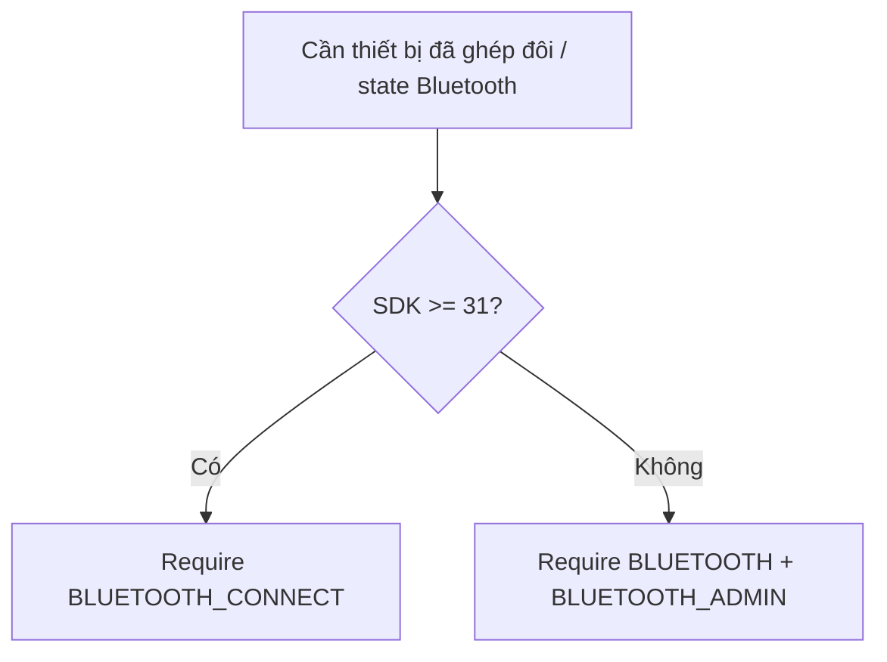
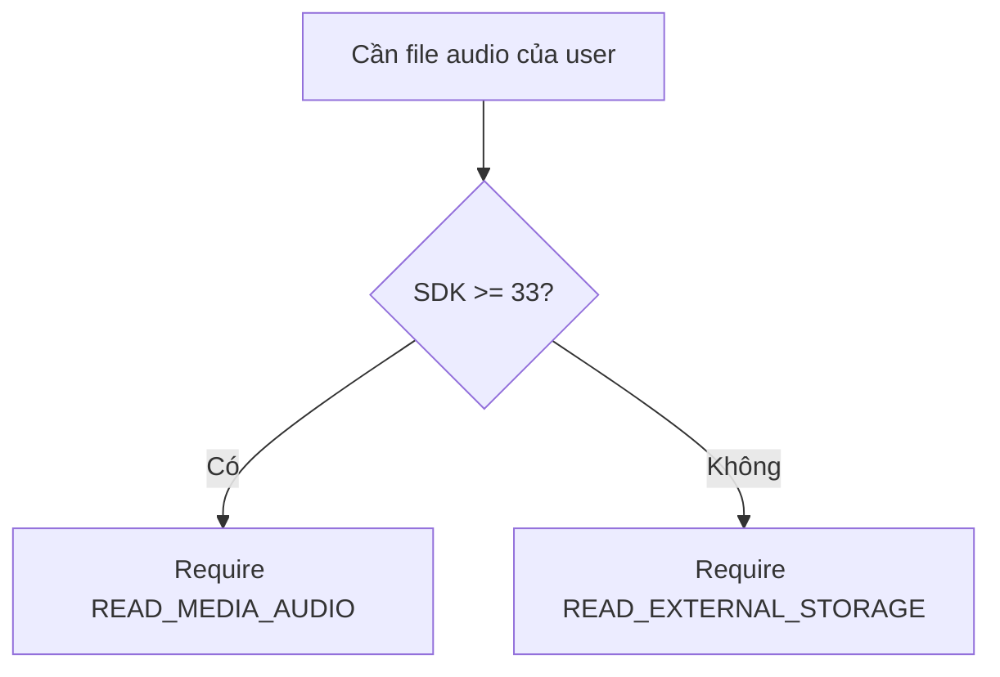

# Tối ưu thiết bị, quyền Android và hành vi OEM

BlueCruise phụ thuộc nhiều vào trạng thái thiết bị: Bluetooth, Android Auto, foreground service, notification, overlay, tối ưu pin và chính sách OEM. Tài liệu này mô tả quyền ứng dụng dùng, lý do cần quyền, hành vi theo phiên bản Android, nhánh OEM và cách kiểm thử thực tế.

## 1. Danh sách quyền

Manifest ứng dụng khai báo:

| Quyền | Phạm vi trong BlueCruise |
| --- | --- |
| `BLUETOOTH` maxSdk 30 | Bluetooth legacy trước Android 12. |
| `BLUETOOTH_ADMIN` maxSdk 30 | Quyền quản trị Bluetooth legacy trước Android 12. |
| `BLUETOOTH_CONNECT` | Đọc thiết bị đã ghép đôi, thiết bị đang connected, MAC address và state Bluetooth trên Android 12+. |
| `BLUETOOTH_SCAN` với `neverForLocation` | Khai báo khả năng scan không dùng cho vị trí. |
| `READ_MEDIA_AUDIO` | Đọc file audio user chọn trên Android 13+. |
| `READ_EXTERNAL_STORAGE` maxSdk 32 | Đọc file audio trước Android 13. |
| `FOREGROUND_SERVICE` | Quyền nền tảng cho foreground service. |
| `FOREGROUND_SERVICE_MEDIA_PLAYBACK` | `AutoPlayMusicService` phát media. |
| `FOREGROUND_SERVICE_SPECIAL_USE` | `KeepAliveService` và `FloatingBubbleService` trên Android 14. |
| `POST_NOTIFICATIONS` | Hiển thị notification trên Android 13+. |
| `RECEIVE_BOOT_COMPLETED` | Restore keep-alive sau reboot. |
| `WAKE_LOCK` | Hỗ trợ độ tin cậy background/runtime. |
| `INTERNET` | Login và download audio từ server. |
| `REQUEST_IGNORE_BATTERY_OPTIMIZATIONS` | Hướng user xin exemption khỏi battery optimization. |
| `SYSTEM_ALERT_WINDOW` | Overlay bong bóng nổi. |

## 2. Quy tắc runtime permission

Bluetooth:



Audio:



Overlay:

- Android M+ check `Settings.canDrawOverlays(context)`.
- Nếu thiếu, app mở `ACTION_MANAGE_OVERLAY_PERMISSION` cho package của app.
- Ứng dụng chỉ persist floating bubble enabled sau khi quyền được cấp.

Notification:

- Manifest khai báo `POST_NOTIFICATIONS`.
- Code hiện start foreground service và build notification; release QA nên verify Android 13+ notification grant path trên thiết bị.

## 3. Battery optimization

BlueCruise check:

```kotlin
PowerManager.isIgnoringBatteryOptimizations(packageName)
```

Nếu ứng dụng vẫn bị optimize, UI hiển thị battery banner. Hành động của user thử các intent:

1. `ACTION_REQUEST_IGNORE_BATTERY_OPTIMIZATIONS`
2. `ACTION_IGNORE_BATTERY_OPTIMIZATION_SETTINGS`
3. Samsung battery intents
4. Dự phòng về màn chi tiết ứng dụng

Giới hạn quan trọng: Android/OEM settings phải do user xác nhận. BlueCruise không thể silently grant battery exemption.

## 4. Auto-start và cài đặt OEM

`DeviceUtils.requestAutoStartPermission()` build danh sách intent theo OEM.

Nhánh hỗ trợ:

| OEM | Chiến lược chính |
| --- | --- |
| Xiaomi / Redmi / Poco | MIUI Security Center auto-start / permission editor, sau đó fallback Android chuẩn. |
| Oppo / OnePlus / Realme | ColorOS/Oppo safe center startup app screens, sau đó fallback. |
| Vivo | Vivo permission manager background startup, sau đó fallback. |
| Samsung | Battery optimization và Smart Manager/Battery screens, sau đó fallback. |
| Huawei / Honor | Huawei startup manager/protected app/app control screens, sau đó fallback. |
| Asus | Asus Mobile Manager, sau đó fallback. |
| Khác | Battery optimization và app details chuẩn Android. |

`isAutoStartGranted()`:

- Thiết bị Xiaomi-like dùng AppOps check không public cho op `10008`.
- Thiết bị khác fallback về trạng thái battery optimization exemption.

Đây là tín hiệu best-effort. OEM API không phải contract public ổn định.

## 5. Hành vi `KeepAliveService`

Mục đích:

- Giữ process BlueCruise sống đủ ổn định cho Bluetooth receiver trên OEM khắt khe.
- Cải thiện hành vi sau khi user xóa app khỏi recents.

Manifest:

```xml
<service
    android:name=".service.KeepAliveService"
    android:foregroundServiceType="specialUse"
    android:exported="false" />
```

Lúc chạy:

- Start dưới dạng foreground service với notification low-importance.
- Trả `START_STICKY`.
- Boot restore chỉ chạy khi:
  - `keep_app_alive` là true,
  - target MAC tồn tại,
  - Bluetooth đang bật.

Rủi ro release:

- `specialUse` foreground service bị review kỹ trên Google Play.
- Phần giải thích sản phẩm phải nêu rõ vì sao độ tin cậy của event Bluetooth cần foreground process lâu dài.

## 6. Hành vi `FloatingBubbleService`

Mục đích:

- Cung cấp hai nút luôn sẵn sàng cho slot 1 và slot 2.
- Cho phép user trigger greeting/goodbye playback mà không cần mở toàn bộ UI.

Quyền và service:

- Cần `SYSTEM_ALERT_WINDOW`.
- Chạy dưới dạng foreground `specialUse` service.
- Dùng `TYPE_APPLICATION_OVERLAY` trên Android O+.

Hành vi an toàn:

- Nếu thiếu overlay permission, setting không được persist là enabled.
- Vị trí bubble được clamp trong màn hình.
- Khi kéo hiển thị dismiss target.
- Drop vào dismiss target sẽ stop service.
- Visual của button đi theo `PlaybackRuntimeStateStore`; không tự giả state playback.

Rủi ro release:

- Overlay permission nhạy cảm và có thể bị store/user trust review.
- Mục đích overlay cần được gắn rõ với shortcut playback.

## 7. Android Auto và độ sẵn sàng của Bluetooth route

BlueCruise cố ý tách các trạng thái:

- Thiết bị Bluetooth ở trạng thái connected.
- Route A2DP ở trạng thái connected.
- Android Auto ở trạng thái candidate.
- Android Auto ở trạng thái ready.

Fast AA readiness signals:

- Gearhead process running.
- Car mode active.
- Remote submix output available.

Lý do:

- Start ngay trên `ACL_CONNECTED` có thể phát qua loa điện thoại trước khi route xe sẵn sàng.
- Chờ mãi có thể bỏ lỡ head unit Bluetooth-only bình thường.
- Thiết bị aftermarket/OXPRO thường có partial signal trước khi full readiness.

Chính sách hiện tại:

- Đường Bluetooth dùng debounce và delay tùy chọn của user.
- Đường Android Auto chờ readiness với poll/dự phòng.
- Target aftermarket dùng retry policy và dự phòng sớm sau stable partial signal.

## 8. Ràng buộc file audio

Ứng dụng mở audio user chọn qua Android document picker và lưu persistable URI permission.

Nguồn bị reject:

- Google Docs/Drive authorities.
- Dropbox.
- OneDrive/SkyDrive.
- Authority generic chứa `cloud`.

Lý do:

- Cloud-backed content có thể không openable local khi service start trong background.
- Kiểm tra playback hiện kỳ vọng URI có thể mở đồng bộ bằng content resolver, file path hoặc resource path.

## 9. Ma trận QA thiết bị

QA thủ công tối thiểu trước khi claim ổn định runtime:

| Thiết bị/OS | Cần verify |
| --- | --- |
| Android 8-10 | Đường quyền Bluetooth legacy, đường quyền lưu trữ, notification của foreground service. |
| Android 11 | Scoped storage với document picker, đường Bluetooth legacy. |
| Android 12 | `BLUETOOTH_CONNECT` runtime permission. |
| Android 13 | `READ_MEDIA_AUDIO` và `POST_NOTIFICATIONS`. |
| Android 14 | FGS type behavior: media playback và special-use services. |
| Xiaomi/Redmi/Poco | Auto-start branch, AppOps grant signal, recents swipe survival. |
| Samsung | Battery optimization/settings fallback, background service survival. |
| Android Auto head unit thật | Candidate/ready timing và không phát sớm qua loa điện thoại. |
| Target aftermarket/OXPRO | Chờ chuẩn bị và hành vi dự phòng. |

## 10. Lệnh validation tập trung

Kiểm tra source-level:

```powershell
.\gradlew.bat --no-daemon :app:testDebugUnitTest --tests "com.vibegravity.bluecruise.common.AudioPermissionRulesTest" --console=plain
.\gradlew.bat --no-daemon :app:testDebugUnitTest --tests "com.vibegravity.bluecruise.ui.BluetoothFragmentTest" --console=plain
.\gradlew.bat --no-daemon :app:testDebugUnitTest --tests "com.vibegravity.bluecruise.receiver.BluetoothConnectionReceiverAndroidAutoTest" --console=plain
```

Kiểm tra runtime trên device/emulator:

```powershell
.\gradlew.bat --no-daemon :app:assembleDebug --console=plain
.\gradlew.bat --no-daemon :app:connectedDebugAndroidTest --console=plain
```

Bằng chứng runtime cần capture:

- Launch ứng dụng và điều hướng login/main.
- Hành vi prompt quyền.
- Danh sách thiết bị mục tiêu.
- Notification keep-alive.
- Notification playback.
- Quyền bubble và hành vi overlay.
- Logcat quanh `BluetoothConnectionReceiver`, `AutoPlayMusicService`, `AndroidAutoReadinessProbe`.

## 11. Posture nhạy cảm release đã biết

Code hiện tại phù hợp cho internal/device testing, nhưng public release review phải xử lý rõ:

- Cleartext HTTP server.
- `FOREGROUND_SERVICE_SPECIAL_USE`.
- Overlay permission.
- Battery optimization exemption request.
- Boot receiver.
- Ý định background process survival.
- MAC address logging trong debug traces.

Không xem các điểm này là chi tiết kỹ thuật nhỏ khi đi Google Play. Chúng là bề mặt product, policy và user trust.
