# Luồng chính của BlueCruise

Tài liệu này mô tả các luồng chính của BlueCruise theo code hiện tại: mở ứng dụng, đăng nhập, đồng bộ âm thanh, chọn xe mục tiêu, tự phát Bluetooth, tự phát Android Auto, play thủ công, bong bóng nổi và đăng xuất.

## 1. Luồng mở ứng dụng

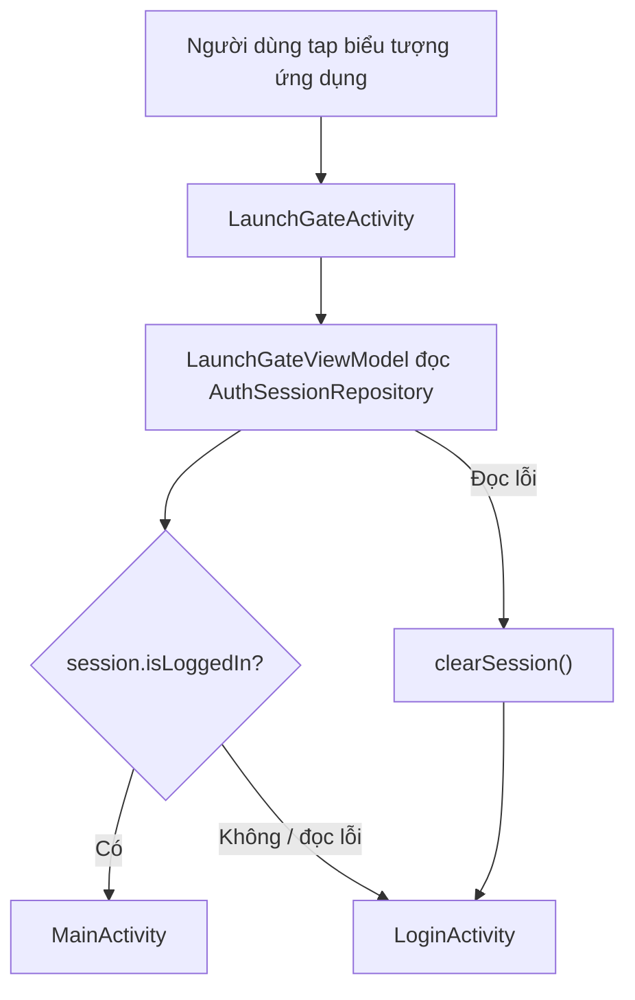

Hành vi:

- `LaunchGateActivity` là launcher activity.
- ViewModel đọc session một lần trong IO dispatcher.
- Session hợp lệ khi có cả `accessToken` và `userId`.
- Nếu đọc session lỗi, ứng dụng clear session rồi chuyển về login.

## 2. Luồng đăng nhập

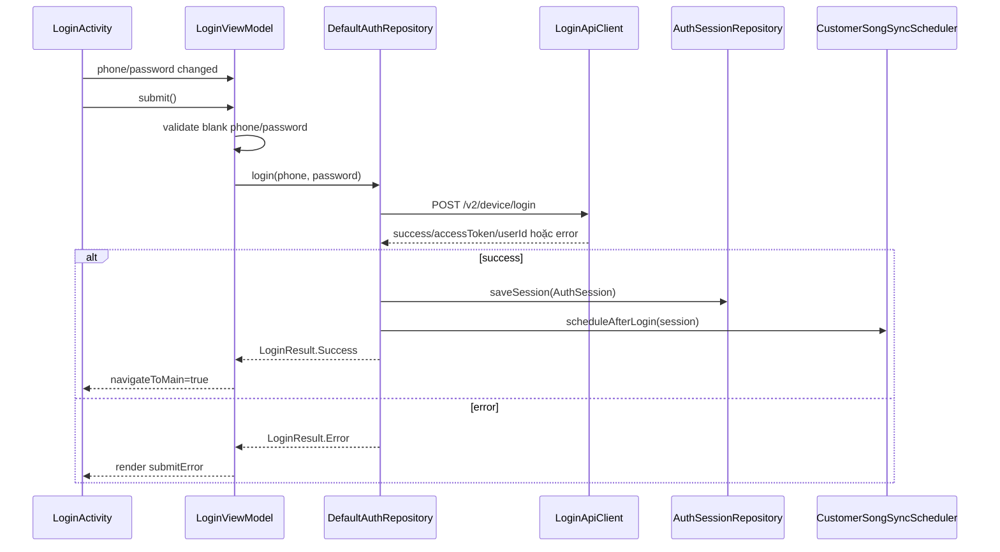

Xác thực input:

- Số điện thoại rỗng -> `Phone is required`.
- Mật khẩu rỗng -> `Password is required`.
- HTTP 401 hoặc message `Invalid credentials` -> invalid credentials.
- IOException -> network error.
- Thiếu token/user ID -> lỗi server.

## 3. Luồng sync song sau login

Sau login thành công:

1. `DefaultAuthRepository` lưu session.
2. `AppScopeCustomerSongSyncScheduler.scheduleAfterLogin(session)` chạy trong application scope.
3. Scheduler dùng mutex để tránh nhiều sync cùng lúc.
4. `DefaultCustomerSongSyncRepository.sync(session, LOGIN)` download slot `hello` và `goodbye`.
5. File được cache vào `filesDir/customer-songs`.
6. Nếu slot đang trống hoặc source là `SERVER`, active slot được cập nhật.
7. Nếu người dùng đã chọn file thủ công, active slot được giữ nguyên, server file chỉ cập nhật cache.

Đồng bộ thủ công từ UI dùng trigger `MANUAL`, overwrite active slot bằng server result nếu download thành công.

## 4. Setup màn chính

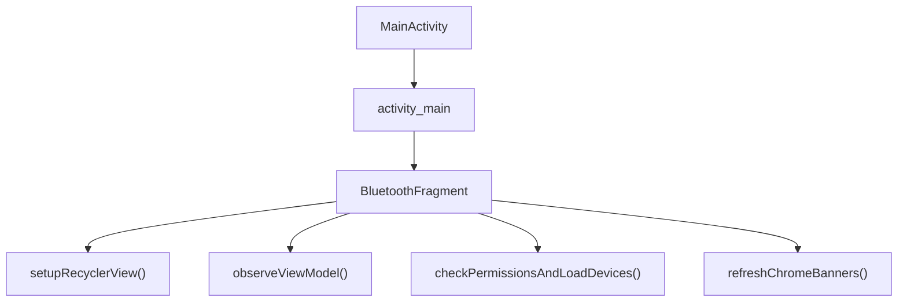

`BluetoothFragment` quản lý:

- Launcher quyền.
- Audio picker.
- Overlay permission.
- Đồng bộ keep-alive service.
- Đồng bộ floating bubble service.
- Start/stop service playback thủ công.
- Điều hướng logout.

## 5. Luồng chọn thiết bị Bluetooth

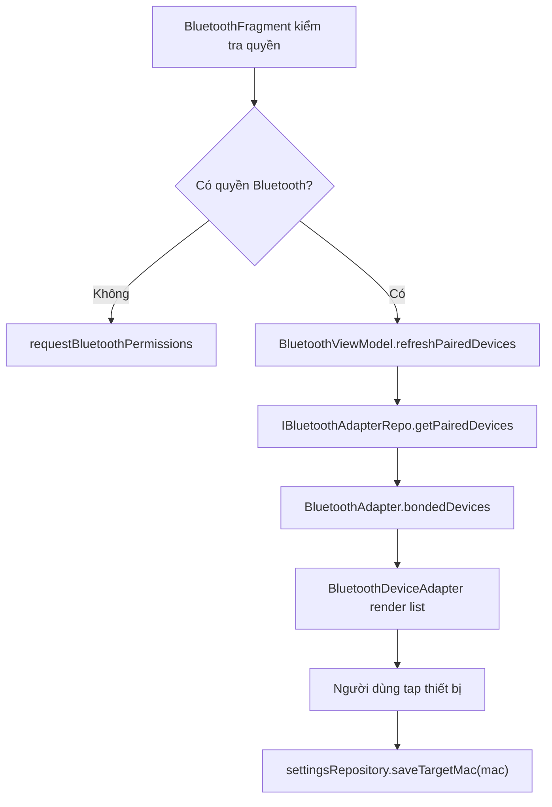

Target MAC là cổng chính cho autoplay. Sự kiện Bluetooth từ thiết bị không phải mục tiêu không được phép start playback.

## 6. Luồng tự phát Bluetooth

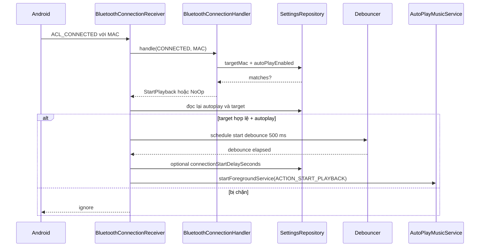

Các kiểm tra quan trọng:

- Null MAC -> no-op.
- Target rỗng -> no-op.
- So sánh MAC không phân biệt hoa/thường.
- Autoplay off -> không start.
- Delay bị clamp trong khoảng 0-10 giây.
- Start được validate lại sau delay để settings change có thể cancel stale start.

## 7. Luồng Bluetooth disconnect

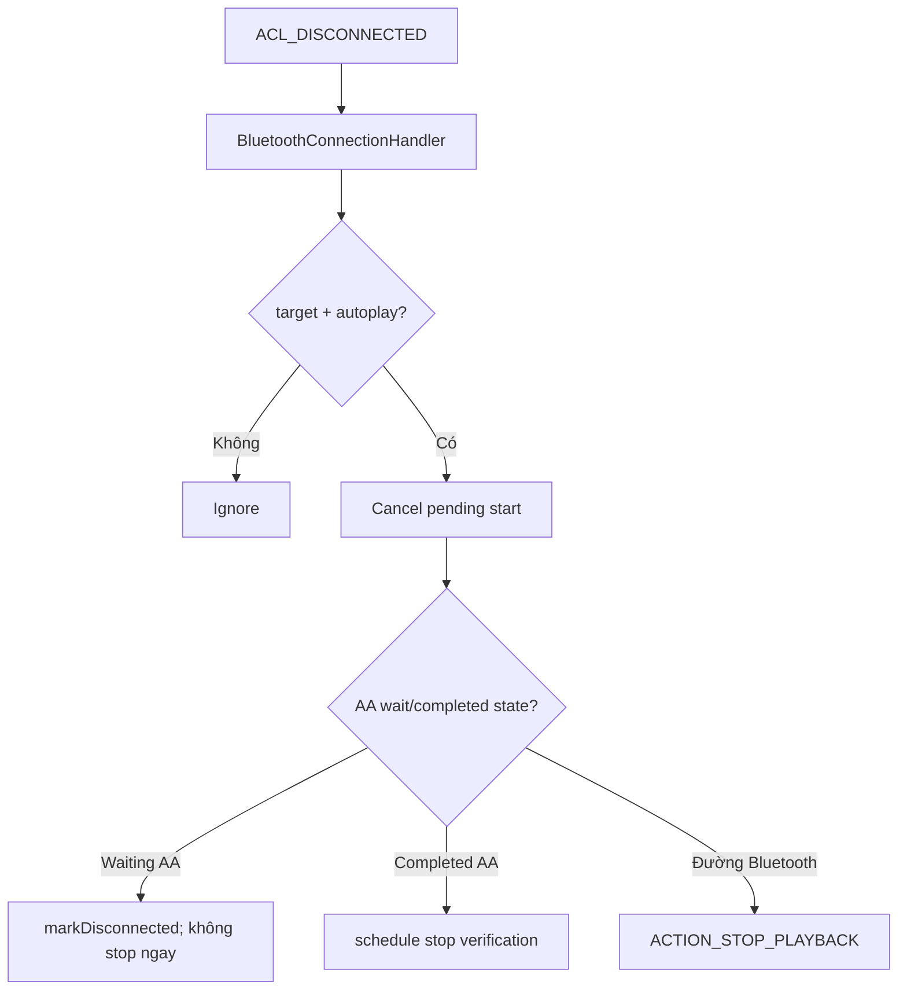

Stop verification tồn tại vì Android Auto có thể drop/reconnect Bluetooth trong thời gian ngắn khi route/session đang ổn định.

## 8. Luồng fallback `STATE_ON`

Khi Bluetooth adapter trở lại `STATE_ON`:

1. Receiver clear/restart handoff session boundary.
2. Chờ 1500 ms.
3. Đọc connected A2DP addresses.
4. Chạy lại target autoplay trigger cho từng MAC đang connected.

Luồng này bắt trường hợp target đã connected trước khi app/receiver thấy rõ ACL event.

## 9. Luồng tự phát Android Auto

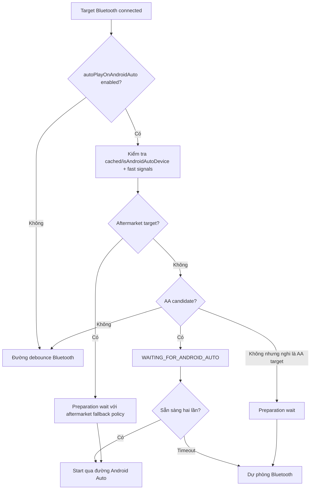

AA candidate:

- Gearhead process OR car mode OR remote submix.

AA ready:

- Gearhead process AND car mode AND remote submix.

Aftermarket/OXPRO behavior:

- Wait theo retry policy.
- Attempt 1 max delay 20 giây.
- Stable partial signal có thể fallback sớm sau 5 giây.

## 10. Luồng play thủ công

Play thủ công bắt đầu từ dòng UI target-car.

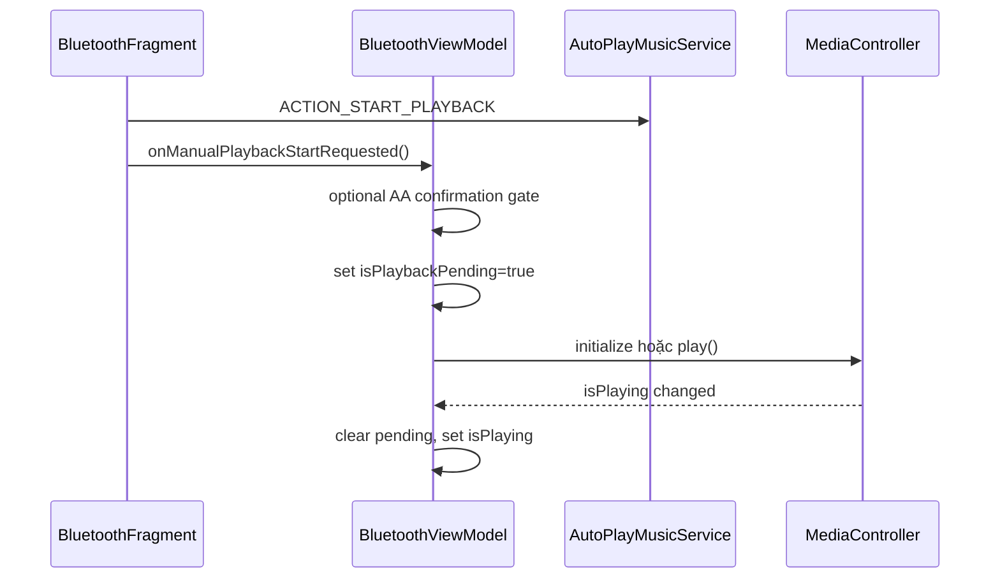

Playback thủ công có pending timeout 8 giây. Nếu khởi tạo controller hoặc play không settle, ViewModel stop service, release controller và reset state để lần tap sau có thể retry.

Playback thủ công là ý định của người dùng, không bị chặn bởi cổng connection-time autoplay.

## 11. Luồng playback service

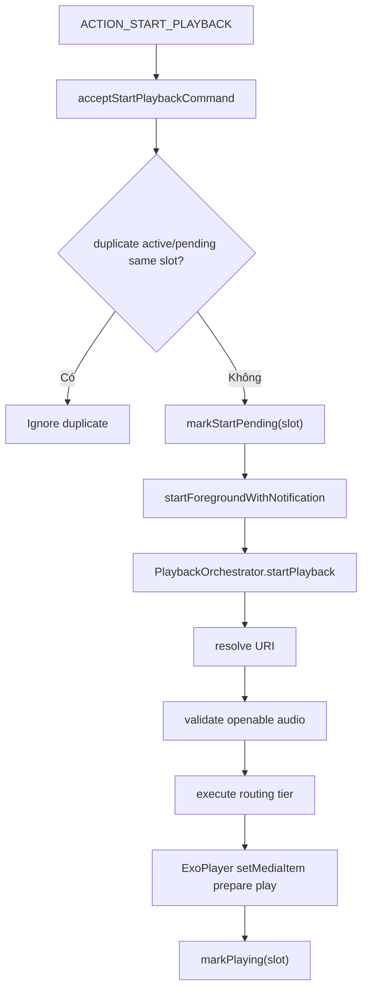

Stop/pause:

- `ACTION_STOP_PLAYBACK` pause vào resumable state thay vì luôn destroy toàn bộ replay context.
- Playback kết thúc tự nhiên thì cleanup và stop service.
- Audio focus loss pause và schedule recovery nếu service chưa stopping.

## 12. Luồng bong bóng nổi

Luồng enable:

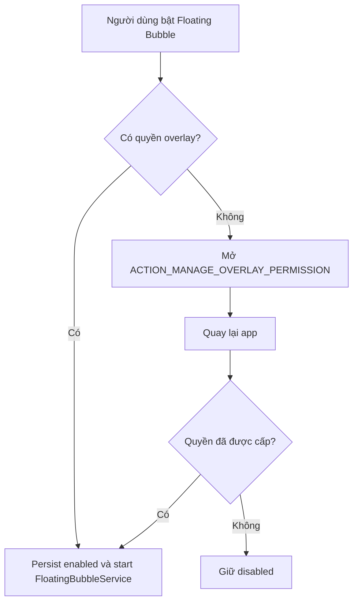

Hành vi tap:

- Tap inactive slot -> start slot đó.
- Tap active/pending slot -> stop playback.
- Switch slot -> gửi start cho slot mới; runtime state quyết định visual state cuối.

Hành vi kéo:

- Bubble clamp trong viewport.
- Snap về cạnh gần nhất.
- Hiện dismiss target khi kéo.
- Drop vào dismiss target thì stop bubble service.

## 13. Luồng chọn file audio

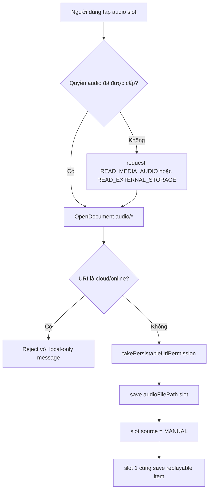

Hiện tại chỉ hỗ trợ local/openable audio theo giả định playback hiện có.

## 14. Luồng keep alive

Enable:

- Người dùng bật `Keep App Alive`.
- `BluetoothFragment` start `KeepAliveService` dạng foreground service.
- Notification cho biết ứng dụng đang chờ kết nối Bluetooth.

Boot restore:

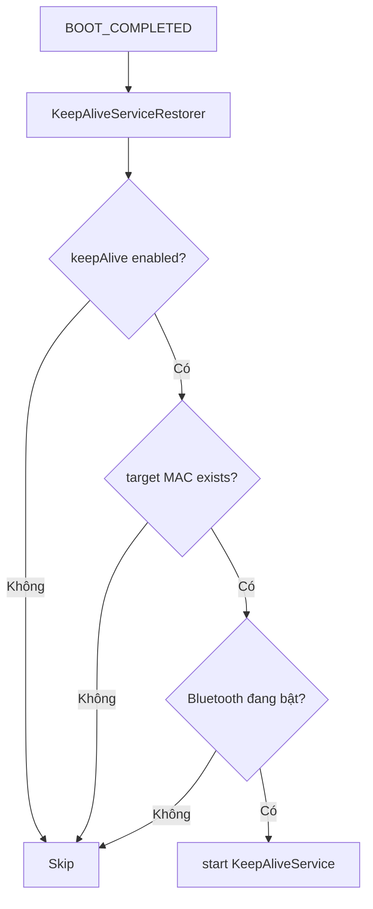

## 15. Luồng logout

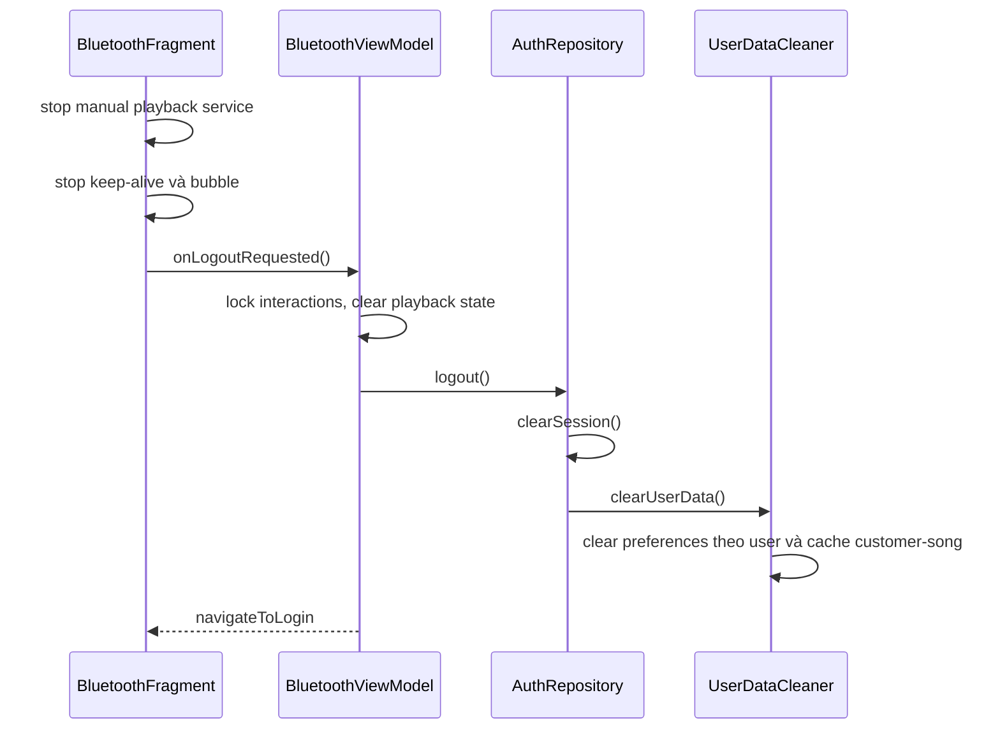

Trong lúc logout, interaction mới bị chặn bởi `isLoggingOut`/`navigateToLogin`.

## 16. Hành vi lỗi và fallback

Fallback người dùng nhìn thấy được kỳ vọng:

- Thiếu quyền Bluetooth -> request permission trước khi load devices.
- Bluetooth disabled -> hiển thị empty state với action mở Bluetooth settings.
- Không có paired device -> hiển thị empty state refresh.
- Battery optimization active -> hiển thị fix banner.
- OEM auto-start chưa granted -> hiển thị auto-start banner.
- Audio permission denied -> hiển thị audio permission message.
- Cloud URI selected -> reject và yêu cầu local file.
- Đồng bộ server thất bại -> toast `Server sync failed`.
- Đồng bộ một phần -> toast `Server sync partially completed`.
- MediaController startup timeout -> clear pending và stop service nội bộ.

## 17. Điểm test cho từng flow

Sử dụng các test tập trung này khi thay đổi flow:

- Launch/login: `LaunchGateViewModelTest`, `LoginViewModelTest`, `LoginActivityTest`.
- Chọn thiết bị/UI state: `BluetoothViewModelTest`, `BluetoothScreenRenderPlanTest`, `BluetoothScreenAdapterTest`.
- Bluetooth/AA autoplay: `BluetoothConnectionReceiverAndroidAutoTest`, `AndroidAutoReadinessProbeTest`, `AndroidAutoHandoffSessionStoreTest`.
- Playback: `AutoPlayMusicServiceTest`, `PlaybackOrchestratorTest`, `PlaybackRuntimeStateStoreTest`.
- Bubble: `FloatingBubbleServiceTest`, `FloatingBubbleControllerTest`.
- Device/OEM: `BluetoothFragmentTest`, `AudioPermissionRulesTest`.
- Customer sync: các test customer trong data module.
