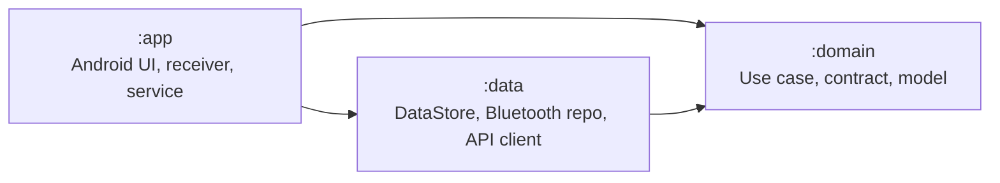
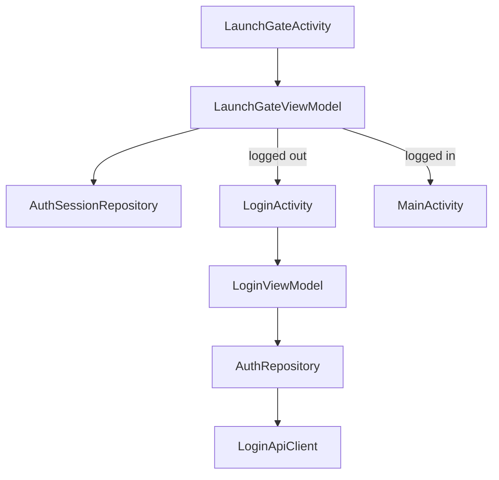
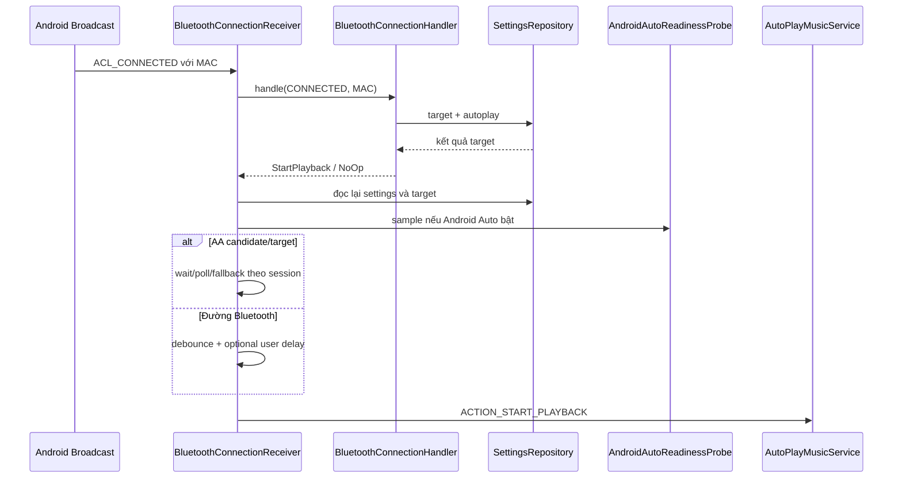

# Kiến trúc kỹ thuật BlueCruise

Tài liệu này mô tả kiến trúc hiện tại của BlueCruise dựa trên mã nguồn, cấu hình Gradle, manifest và test trong repository. Nội dung tập trung vào cách hệ thống thật sự vận hành: ranh giới module, dependency injection, lưu state, handoff Bluetooth/Android Auto, service playback, service overlay và các điểm rủi ro kỹ thuật.

## 1. Tổng quan kiến trúc

BlueCruise là Android app native viết bằng Kotlin, chia thành ba module Gradle:



Quan hệ module:

- `:app` phụ thuộc `:domain` và `:data`.
- `:data` phụ thuộc `:domain`.
- `:domain` không phụ thuộc Android UI hoặc data implementation.

Thông tin nền:

- Package/app ID: `com.vibegravity.bluecruise`
- Min SDK: 26
- Target SDK: 34
- Compile SDK: 34
- DI: Hilt
- UI: AppCompat, Material, RecyclerView, ViewBinding
- Playback: Media3 ExoPlayer + MediaSessionService + MediaSessionCompat
- Lưu trữ: DataStore Preferences
- Mạng: OkHttp + kotlinx-serialization JSON
- Kiểm thử: JUnit4, MockK, coroutines-test, Turbine, Robolectric, Espresso

## 2. Module `:domain`

`domain` giữ contract và logic ít phụ thuộc Android framework.

Các nhóm chính:

- Bluetooth:
  - `BluetoothConnectionHandler`
  - `BluetoothEventType`
  - `BluetoothConnectionAction`
  - `GetPairedDevicesUseCase`
  - `VerifyTargetBluetoothDeviceUseCase`
- Repository contract:
  - `SettingsRepository`
  - `IBluetoothAdapterRepo`
  - `AuthRepository`
  - `AuthSessionRepository`
  - `CustomerSongSyncRepository`
  - `CustomerSongSyncScheduler`
  - `UserDataCleaner`
- Customer song:
  - `CustomerSongType`
  - `CustomerSongSyncTrigger`
  - `CustomerSongSyncOutcome`
  - `SongSlotSource`
- Routing:
  - `RoutingExecutor`

Ranh giới quan trọng: domain quyết định "sự kiện Bluetooth target này nên start/stop/no-op", nhưng không tự start Android service. Việc start service thuộc `:app`.

## 3. Module `:data`

`data` hiện thực repository bằng Android, DataStore và OkHttp.

### Lưu settings

`PreferencesManager` implement `SettingsRepository` trên DataStore `bluecruise_prefs`.

Nhóm preference:

- Target/autoplay:
  - `target_mac`
  - `auto_play_enabled`
  - `connection_start_delay_seconds`
  - `auto_play_on_android_auto`
  - `aftermarket_android_auto_target_macs`
- Service runtime:
  - `keep_app_alive`
  - `floating_bubble_enabled`
  - `routing_tier`
  - `auto_start_dismissed`
- Audio:
  - `audio_file_path`
  - `audio_file_path_2`
  - server audio path/title cho slot 1/2
  - source slot 1/2: `SERVER` hoặc `MANUAL`
- Replay/session:
  - replay URI/title/target/AA flag
  - resume eligibility
  - prepared timestamp
- Auth/sync tracking:
  - last server sync user/time

`clearUserScopedData()` xóa toàn bộ state gắn với user hiện tại, gồm target, audio, server cache reference, replay data và service settings.

### Dữ liệu auth

`DefaultAuthRepository`:

- Kiểm tra phone/password không rỗng.
- Gọi `LoginApiClient`.
- Lưu `AuthSession` nếu response có `accessToken` và `userId`.
- Lên lịch đồng bộ customer-song sau login.
- Logout bằng cách clear session và gọi `UserDataCleaner`.

`AuthPreferencesStore` lưu:

- `auth_access_token`
- `auth_user_id`

### Dữ liệu customer song

`CustomerSongApiClient` gọi:

```text
POST /v2/device/download
Authorization: Bearer <accessToken>
Nội dung request: {"userId":"...","type":"hello|goodbye"}
```

`DefaultCustomerSongFileStore` ghi file vào:

```text
filesDir/customer-songs/customer_<sanitized-user-id>_<hello|goodbye>.<extension>
```

`DefaultCustomerSongSyncRepository` tải cả hai slot:

- `HELLO` -> slot 1.
- `GOODBYE` -> slot 2.
- Đồng bộ thủ công overwrite active slot.
- Đồng bộ sau login chỉ overwrite nếu slot trống hoặc source đang là `SERVER`.
- Nếu người dùng đã chọn file manual, login sync chỉ cập nhật cache server.

### Dữ liệu Bluetooth

`BluetoothAdapterRepo`:

- Đọc paired devices từ `BluetoothAdapter.bondedDevices`.
- Theo dõi state Bluetooth enabled bằng broadcast flow.
- Lấy A2DP connected addresses qua `BluetoothProfile.A2DP`.
- Dấu hiệu heuristic của thiết bị Android Auto:
  - UUID A2DP Sink `0000112E-0000-1000-8000-00805F9B34FB`.
  - Bluetooth class `AUDIO_VIDEO_CAR_AUDIO`.
  - Tên thiết bị giống head unit/car/multimedia/navigation.
- Detect Gearhead process bằng `GearheadProcessMatcher`.

## 4. Module `:app`

`app` chứa Android runtime thực tế.

### Application và DI

`BlueCruiseApp`:

- Annotated `@HiltAndroidApp`.
- Plant Timber debug tree khi debug build.

Hilt module:

- `AppModule`: bind Bluetooth repo, settings repo, routing executor, media controller provider.
- `AuthModule`: provide OkHttp, JSON, API base URL, auth/session/customer-song dependency.
- `DataModule`: bind Bluetooth manager wrapper.
- `DispatchersModule`: provide IO/Main dispatcher và application-scope coroutine.

API base URL hiện hardcode:

```text
http://103.118.28.117/api
```

## 5. Kiến trúc UI

### Launch và auth



`LaunchGateActivity` chỉ điều hướng; business logic nằm trong `LaunchGateViewModel`.

`LoginActivity`:

- Bind input phone/password.
- Render error/loading state.
- Điều hướng sang `MainActivity` khi login thành công.

### Màn chính

`MainActivity` chỉ set layout. UI chính nằm trong `BluetoothFragment`.

`BluetoothFragment` làm nhiệm vụ:

- Setup RecyclerView và adapter.
- Request quyền Bluetooth/audio/overlay.
- Mở audio picker.
- Start/stop `AutoPlayMusicService`.
- Đồng bộ `KeepAliveService`.
- Đồng bộ `FloatingBubbleService`.
- Mở battery optimization và auto-start settings.
- Observe `BluetoothViewModel.uiState`.

`BluetoothViewModel` giữ state:

- Bluetooth enabled.
- Thiết bị đã ghép đôi.
- Target MAC.
- Flag autoplay.
- Flag Android Auto.
- Path file audio.
- Nguồn bài hát.
- Bong bóng nổi.
- Routing tier.
- Playback pending/playing.
- Đồng bộ server.
- Điều hướng logout.

`BluetoothScreenRenderPlan` tách tính toán render để giảm coupling với adapter và có test riêng.

## 6. Kiến trúc Bluetooth receiver

Receiver chính: `BluetoothConnectionReceiver`.

Input broadcast:

- `ACL_CONNECTED`
- `ACL_DISCONNECTED`
- `BluetoothAdapter.ACTION_STATE_CHANGED`
- `BOOT_COMPLETED`

Đường start:



Đường stop:

- Non-target disconnect: ignore.
- Target Bluetooth-only disconnect: stop playback.
- State chờ Android Auto: mark disconnected.
- Android Auto completed: lên lịch stop verification trước khi stop.

Debounce:

- Start debounce mặc định 500 ms.
- STATE_ON fallback delay 1500 ms.
- Stop verification delay 6000 ms.

## 7. Android Auto handoff

Logic Android Auto tách rõ "Bluetooth device connected" khỏi "AA route ready".

Các class chính:

- `AndroidAutoReadinessProbe`
- `AndroidAutoHandoffSessionStore`
- `AndroidAutoRetryPolicy`
- `AndroidAutoDetectionReceiver`

Tín hiệu readiness:

- Gearhead process running.
- Thiết bị ở car mode.
- Remote submix output tồn tại.
- Cached target device heuristic.

Quy tắc:

- Candidate: có ít nhất một fast readiness signal.
- Ready: Gearhead process + car mode + remote submix.
- Cached target-device flag giúp quyết định có nên wait, nhưng không tự làm AA ready.

Session store chống duplicate/stale start:

- Reuse cùng active session cho cùng target MAC.
- Clear khi MAC đổi, Bluetooth restart hoặc có disconnect boundary.
- Ignore stale mutator sau fresh session boundary.

## 8. Kiến trúc playback

`AutoPlayMusicService` là owner của playback.

Trách nhiệm:

- Tạo ExoPlayer.
- Tạo Media3 `MediaSession`.
- Tạo `MediaSessionCompat` cho notification/routing compatibility.
- Start foreground với media notification.
- Nhận explicit service command.
- Xử lý MediaSession callback.
- Quản lý audio focus.
- Theo dõi playback command version để bỏ qua stale async startup result.
- Đồng bộ runtime playback state.

Action của service:

```text
com.vibegravity.bluecruise.action.START_PLAYBACK
com.vibegravity.bluecruise.action.STOP_PLAYBACK
```

Extra:

```text
EXTRA_AUDIO_SLOT
EXTRA_AUDIO_URI_OVERRIDE
```

Chống duplicate:

- `PlaybackRuntimeStateStore.markStartPending(slot)` trước startup.
- Duplicate start bị ignore khi cùng slot đang active hoặc transition pending.
- Stale startup result bị ignore khi command version không còn khớp.

Resume thụ động từ hệ thống:

- System UI controller như `com.android.systemui` và `miui.systemui.plugin` bị chặn nếu resume không hợp lệ.
- App/manual resume tách biệt với passive resumption.

## 9. Playback orchestrator và routing

`PlaybackOrchestrator` resolve URI audio có thể phát theo thứ tự:

1. Override explicit.
2. URI slot đã lưu.
3. URI mặc định được cung cấp.
4. Raw fallback đóng gói sẵn:
   - slot 1 -> `default_greeting.mp3`
   - slot 2 -> `default_goodbye.mp3`

Kiểm tra trước khi play:

- Reject online/cloud content URI.
- Verify URI có thể mở được.
- Verify MIME type bắt đầu bằng `audio`.
- Execute routing tier.
- Set MediaItem tại position 0.
- Prepare và play.

`SmartAutoRoutingEngine` implement routing tier:

- Tier 1: short silent playback nudge.
- Tier 2: MediaSessionCompat state toggling.
- Tier 3: temporary SCO/HFP style route nudge.

Nếu Android Auto đã ở car mode, routing exploit được skip.

## 10. Foreground service

### `AutoPlayMusicService`

- Type: `mediaPlayback`
- Exported: true
- Chủ sở hữu media session và playback notification.

### `KeepAliveService`

- Type: `specialUse`
- Exported: false
- Giữ process sống để tăng độ tin cậy Bluetooth receiver.
- Restore sau boot chỉ khi keep-alive bật, có target và Bluetooth bật.

### `FloatingBubbleService`

- Type: `specialUse`
- Exported: false
- Cần overlay permission.
- Cung cấp overlay điều khiển hai slot playback.
- Dùng playback runtime state để phản ánh active/pending state thật.

## 11. Bề mặt security và release-sensitive

Các vùng nhạy cảm khi release:

- HTTP API và cleartext network config cho `103.118.28.117`.
- Bearer token lưu trong DataStore preferences.
- `SYSTEM_ALERT_WINDOW`.
- `REQUEST_IGNORE_BATTERY_OPTIMIZATIONS`.
- `FOREGROUND_SERVICE_SPECIAL_USE`.
- Boot receiver và hành vi keep-alive process.
- Log debug có thể chứa MAC address và runtime state.

Hardening trước phát hành cần review các điểm này trước khi submit Google Play công khai.

## 12. Invariant kiến trúc

Không phá các điểm này nếu chưa có quyết định thiết kế rõ ràng:

- `AndroidAutoDetectionReceiver` không được own playback start; playback start thuộc `BluetoothConnectionReceiver`.
- Gating target Bluetooth phải reject non-target MAC sớm.
- Playback thủ công không bị block bởi setting autoplay dành cho connection-triggered autoplay.
- Android Auto readiness không được gộp thành A2DP connected state đơn giản.
- Startup playback phải giữ bảo vệ duplicate/stale command.
- Logout phải clear auth session và settings/cache theo user.
- Cloud audio URI rejection nên giữ nguyên trừ khi có thiết kế streaming an toàn cho background.

## 13. Bản đồ test coverage

Kiểm thử hiện có bảo vệ:

- Auth và launch gate.
- Xác minh target Bluetooth.
- Hành vi chờ/dự phòng Android Auto của receiver.
- Handoff session reuse/stale mutation.
- Media3 service duplicate/resume behavior.
- Fallback/validation audio của playback orchestrator.
- Hành vi tap/drag/dismiss của bong bóng nổi.
- Quy tắc quyền và hành vi banner OEM.
- Customer-song download/cache/sync behavior.

Khi đổi kiến trúc, tối thiểu chạy:

```powershell
.\gradlew.bat --no-daemon :domain:test --console=plain
.\gradlew.bat --no-daemon :data:testDebugUnitTest --console=plain
.\gradlew.bat --no-daemon :app:testDebugUnitTest --console=plain
```
